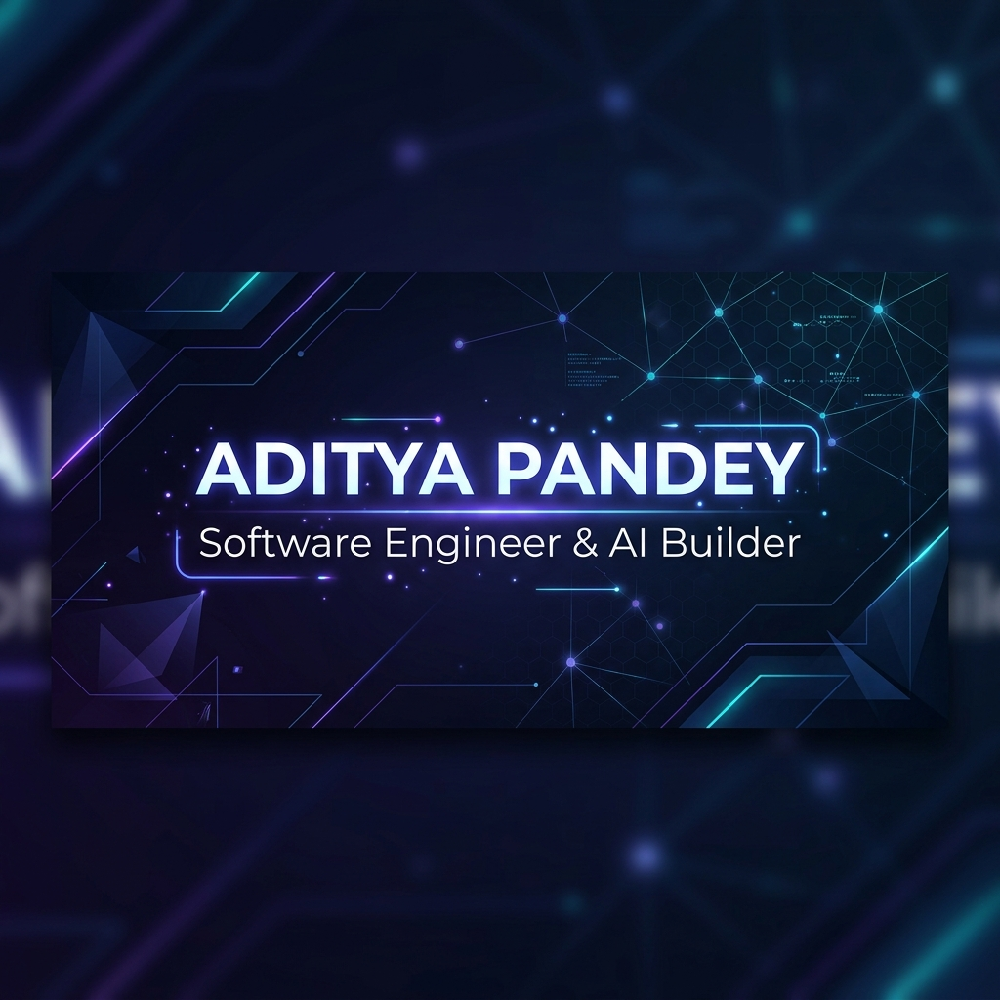

  

 

# ⚡ Hey there, I'm Aditya Pandey! ⚡
### 🚀 **AI Engineer | Full-Stack Developer | System & Optimization Architect**

🧑‍💻 Specializing in **Agentic AI Systems, Operations Research Solvers, and Localized Generative Applications**.  
🎓 Built production-grade software for **FOSSEE, IIT Bombay (eSim Fellowship)** and high-impact AI architectures.  
💎 Committed to writing clean, SOLID, test-driven, and highly scalable software.

 

---

## 🛠️ Tech Ecosystem & Stack

  
  
  
  
  
  
  
  
  
  

| Area | Technologies |
| :--- | :--- |
| **Languages** | `Python`, `TypeScript`, `JavaScript`, `SQL`, `HTML5/CSS3` |
| **Backend & Solvers** | `FastAPI`, `Flask`, `SQLAlchemy`, `Alembic`, `Linear Programming Solvers` |
| **Frontend UI** | `Next.js 15`, `React 19`, `Tailwind CSS`, `Zustand`, `Framer Motion`, `Streamlit` |
| **Agentic AI** | `Google Gemini API`, `Observe-Plan-Act Loops`, `Grounding & Hallucination Verification` |
| **Systems & DevOps** | `Git`, `Docker`, `Windows Systems (winreg)`, `winget`, `Chocolatey`, `Vercel`, `Render` |

---

## 🌟 Featured Public Repositories

### 1. 🤖 [AI Email Response System](https://github.com/ADITYA-PANDEY99/ai-email-response-system)
> **Automated, intelligent email draft generation and contextual response agent.**
- **Overview:** Autonomous email processing system leveraging LLMs to analyze incoming communications, categorize intent, and draft context-aware, highly personalized responses.
- **Tech Stack:** `Python`, `FastAPI`, `Google Gemini API`, `LLM Agent Workflows`.

### 2. 📊 [CSV CRM Importer](https://github.com/ADITYA-PANDEY99/csv-crm-importer)
> **High-throughput CSV data ingestion and normalization pipeline for CRM platforms.**
- **Overview:** Robust data pipeline designed to parse, validate, deduplicate, and ingest bulk customer relationship data into CRM schemas with real-time error logging and schema mapping.
- **Tech Stack:** `Python`, `TypeScript`, `React`, `FastAPI`, `SQLAlchemy`.

### 3. ⚡ [eSim AI Assistant](https://github.com/ADITYA-PANDEY99/esim-ai-assistant)
> **AI Copilot for Open-Source Circuit Simulation and EDA Software.**
- **Overview:** Specialized AI assistant designed to streamline circuit simulation workflows, generate EDA scripts, and assist engineers using eSim & ngspice.
- **Tech Stack:** `Python`, `Gemini API`, `Streamlit`, `eSim EDA Integration`.

### 4. 🔬 [FOSSEE Osdag SFD BMD](https://github.com/ADITYA-PANDEY99/fossee-osdag-sfd-bmd) *(IIT Bombay Fellowship Project)*
> **Shear Force & Bending Moment Diagram Analysis Engine for Osdag Structural Design.**
- **Overview:** Developed for the FOSSEE Project at IIT Bombay. Generates precise SFD/BMD analytical plots and structural engineering calculation reports.
- **Tech Stack:** `Python`, `PyQt / GUI`, `NumPy`, `Matplotlib`, `Structural Mechanics Solvers`.

### 5. 🛡️ [Game of Cybersecurity](https://github.com/ADITYA-PANDEY99/Game_Of_CyberSecurity)
> **Interactive cybersecurity learning and gamified threat defense simulator.**
- **Overview:** Educational platform showcasing core security principles, attack/defense vector simulations, and interactive vulnerability challenges.
- **Tech Stack:** `Python`, `JavaScript`, `Security Simulation Frameworks`.

---

## 📊 Git & Contribution Activity

| **GitHub Statistics** | **Top Languages** |
| :---: | :---: |
|  |  |

 

  

---

  <h3>🤝 Let's Connect!</h3>
  
I am always open to discussing software engineering roles, AI research collaborations, and open-source innovations.

  
📬 Reach me at: <b>adityapandey779922@gmail.com</b>

   
  Designed with ❤️ by Antigravity AI

